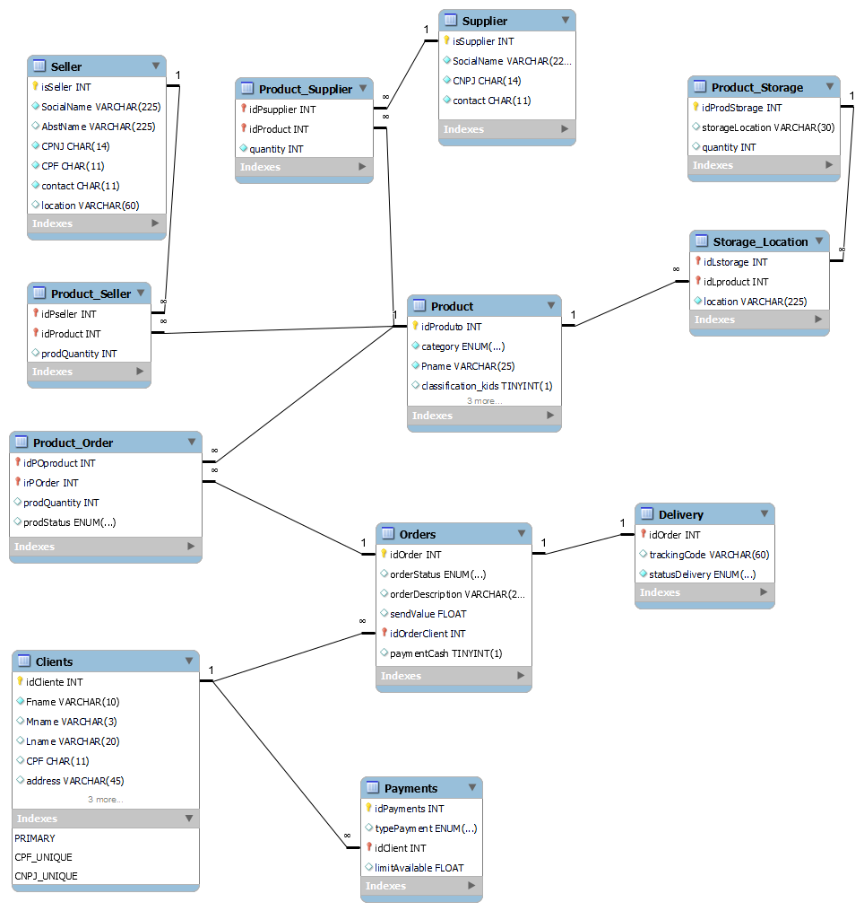

    

## 💻 Projeto
Esse é um desafio de projeto com SQL, desenvolvido durante o Potência Tech powered by iFood | Ciência de Dados da DIO.

## 🚀 Objetivo
Aplicar o mapeamento para o cenário:

“Refine o modelo apresentado acrescentando os seguintes pontos”:
- Cliente PJ e PF – Uma conta pode ser PJ ou PF, mas não pode ter as duas informações;
- Pagamento – Pode ter cadastrado mais de uma forma de pagamento;
- Entrega – Possui status e código de rastreio;

Algumas das perguntas que pode fazer para embasar as queries SQL:
- Quantos pedidos foram feitos por cada cliente?
- Algum vendedor também é fornecedor?
- Relação de produtos fornecedores e estoques;
- Relação de nomes dos fornecedores e nomes dos produtos;

Além das queries requeridas, foi adicionada uma query com maiores informações do rastreio de um pedido.