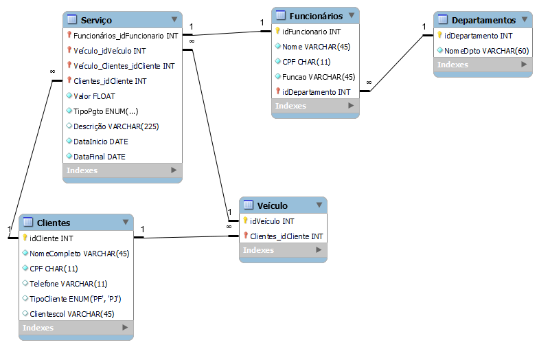

## 💻 Projeto
Esse é um desafio de projeto com SQL, desenvolvido durante o Potência Tech powered by iFood | Ciência de Dados da DIO.

## 🚀 Objetivo
Para este cenário você irá utilizar seu esquema conceitual, criado no desafio do módulo de modelagem de BD com modelo ER, para criar o esquema lógico para o contexto de uma oficina. 
Neste desafio, você definirá todas as etapas. Desde o esquema até a implementação do banco de dados. Sendo assim, neste projeto você será o protagonista. Tenha os mesmos cuidados, apontados no desafio anterior, ao modelar o esquema utilizando o modelo relacional.

## ⭐ Desenvolvimento
Primeiramente, foi desenvolvido o modelo para o projeto, criando as tabelas: Clientes, Veículos, Serviços, Funcionários e Departamentos.

    

Após definido o modelo, foi implementado no BD, realizando a inserção de dados e as seguintes queries:
- Informações dos funcionários;
- Contar quantos funcionários no departamento mecânico;
- Veículos cadastrados dos clientes;
- Mostrar clientes PJs;
- Serviços feitos de acordo com cada funcionário.